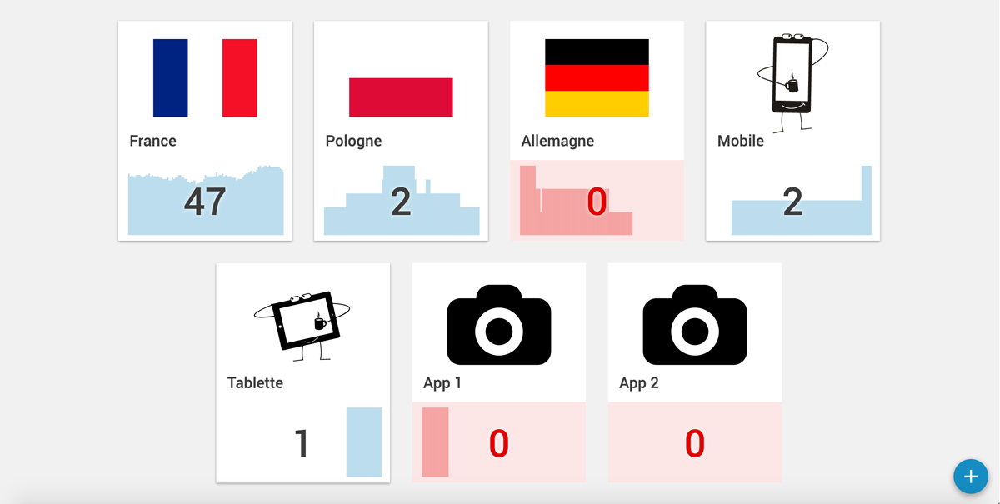

#Multi sites real time Analytics

Based on Google Analytics real time api, this dashboard app will allow you to track how many user are now visiting multiple your sites.


##Installation

### First, install dependencies

```bash
npm i
bower i
```
### Configure default websites
Create a `src/js/configuration.js` file (see `src/js/configuration.js.example`)

1. Enter your Google Analytics API Client Id, whitch should looks like this `XXXXXXXXXXXXXXXXXXXXXXXXXXXXXXXXXXXXXXXXXXXXX.apps.googleusercontent.com`
2. Make sure to subscribe to Real Time API (beta)
3. Save your favorite(s) website(s) to track

```javascript
{
	view  : 'ga:XXXXXXXX',
	image : {
		type   : 'image/svg+xml',
		base64 : 'PD94bWwgdmVyc2lvbj0iMS4wIiBlbmNvZGluZz0idXRmLTgiPz48c3ZnIHZlcnNpb249IjEuMSIgaWQ9IkNhbHF1ZV8xIiB4bWxucz0iaHR0cDovL3d3dy53My5vcmcvMjAwMC9zdmciIHhtbG5zOnhsaW5rPSJodHRwOi8vd3d3LnczLm9yZy8xOTk5L3hsaW5rIiB4PSIwcHgiIHk9IjBweCIgdmlld0JveD0iMCAwIDEwMCA5Ni4yIiBzdHlsZT0iZW5hYmxlLWJhY2tncm91bmQ6bmV3IDAgMCAxMDAgOTYuMjsiIHhtbDpzcGFjZT0icHJlc2VydmUiPjxnPjxwYXRoIGQ9Ik01MCw0MS42Yy03LjIsMC0xMyw1LjgtMTMsMTNzNS44LDEzLDEzLDEzczEzLTUuOCwxMy0xM1M1Ny4yLDQxLjYsNTAsNDEuNnoiLz48cGF0aCBkPSJNODcsMjIuNkg3MmMwLTcuMi01LjgtMTMtMTMtMTNINDFjLTcuMiwwLTEzLDUuOC0xMywxM0gxM2MtNy4yLDAtMTMsNS44LTEzLDEzdjM4YzAsNy4yLDUuOCwxMywxMywxM2g3NGM3LjIsMCwxMy01LjgsMTMtMTN2LTM4QzEwMCwyOC40LDk0LjIsMjIuNiw4NywyMi42eiBNNTAsNzcuNmMtMTIuNywwLTIzLTEwLjMtMjMtMjNzMTAuMy0yMywyMy0yM3MyMywxMC4zLDIzLDIzUzYyLjcsNzcuNiw1MCw3Ny42eiIvPjwvZz48L3N2Zz4='
	},
},
```

##Run dev sever
Run dev server with gulp & livereload
```bash
gulp watch
```
